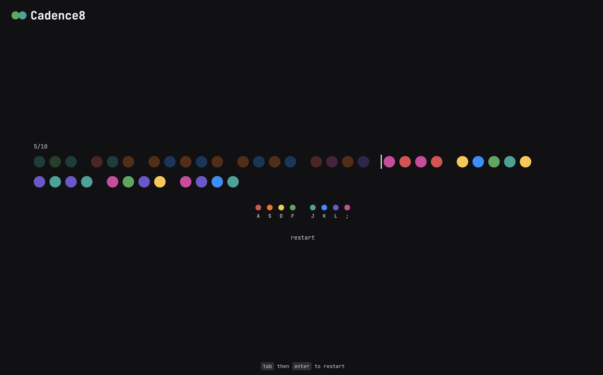

# Cadence8

Cadence8 is a minimalist browser game where you press home-row keys to match a
stream of colored dots.



## How to play

- Rest your fingers on `A S D F` and `J K L ;`. Each key has its own color, shown
  in the legend below the stream.
- Press the key for each dot, reading ahead to the next group. Timing starts on
  the first key.
- A wrong key is marked and still advances. `Backspace` steps back to fix it, but
  the mistake still counts against accuracy.
- The run ends on its last dot and shows dots per minute, accuracy, raw rate,
  consistency, and time.
- `Tab` then `Enter` starts a new run.

Keys are read by physical position, so any keyboard layout plays the same home
row.

## How it's built

- Angular with strict TypeScript, standalone components, and signals.
- The game rules (sequence generation, run state, and scoring) are plain
  TypeScript in `src/app/game/`, separate from the components that render them,
  so they are unit tested without a browser.
- Vitest for tests and ESLint for linting. GitHub Actions runs lint, tests, and a
  production build on every push.

## Roadmap

- Sound, caret and feedback animations, and a guided introduction for new
  players.
- Accounts and score history through a Spring Boot REST API, with PostgreSQL for
  users and scores and Redis for sessions and rate limiting.
- One Docker image serving both the API and the app, deployed at `cadence8.com`.

## Running locally

Requires Node.js 24.

```sh
npm ci
npm start
```

Then open http://localhost:4200.

- `npm test` runs the unit tests.
- `npm run lint` checks the code.
- `npm run build` creates a production build in `dist/`.
